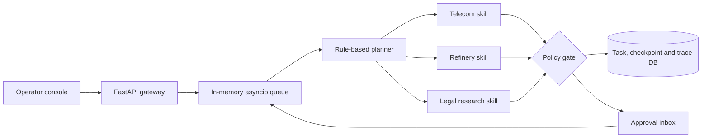

# Industrial SuperAgent Workbench

[](https://github.com/ZhengjunSun/industrial-superagent-workbench/actions/workflows/ci.yml)

A single-process industrial workflow prototype with a browser console. Keyword rules select sequential domain tools; SQLite persists task state and approvals. A model adapter synthesizes the final response. This is not autonomous multi-agent planning or a distributed production platform.



## Why this is more than a chat demo

- Persistent lifecycle with queued, running, waiting-approval, completed, failed and cancelled states
- Keyword planning with telecom, refinery and legal tool modules, not isolated processes
- SQLite checkpoints; an in-memory queue rebuilt from up to 200 recent tasks on startup
- Stored-result reuse, bounded retries and cooperative cancellation; no exactly-once external side-effect guarantee
- Approval before high-risk tool calls; reviewer identity enters the audit trail
- OpenAI-compatible model adapter plus offline deterministic provider
- Structured spans for agent, model, tool and policy operations
- FastAPI API, SSE event stream and browser operator console
- Docker image, Compose deployment, unit and API tests

## Quick start

```bash
python -m venv .venv
# Windows: .venv\Scripts\activate
pip install -e ".[dev]"
uvicorn superagent.api:app --reload
```

Open <http://localhost:8000>. No API key is required for the offline provider.

To connect an OpenAI-compatible endpoint:

```bash
set AGENT_MODEL_PROVIDER=openai-compatible
set AGENT_MODEL_BASE_URL=http://localhost:11434/v1
set AGENT_MODEL_NAME=qwen3
set AGENT_MODEL_API_KEY=local-placeholder
```

## Docker

```bash
docker compose up --build
```

## Verify the claims

- [Architecture and reliability model](docs/architecture.md)
- [Five-minute operator demo](docs/demo.md)
- [Reproducible benchmark report](docs/benchmark.md)

Run the same benchmark locally:

```bash
python scripts/benchmark.py --tasks 100
```

## Safety and provenance

All scenarios, logs, rules, prices and provisions are synthetic. The project is an independent portfolio implementation and contains no employer code, customer data or internal documentation. Tools are advisory and do not connect to operational systems.

## License

MIT
