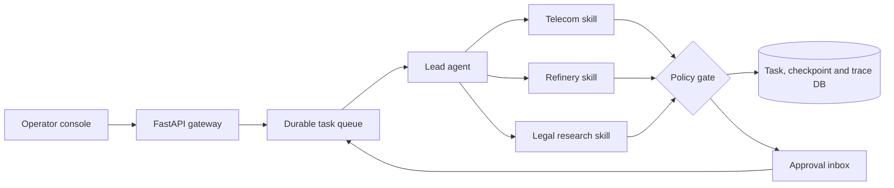

# Industrial SuperAgent Workbench

[](https://github.com/ZhengjunSun/industrial-superagent-workbench/actions/workflows/ci.yml)

A full-stack, durable multi-agent workbench for long-running industrial tasks. A lead agent plans work, delegates to bounded domain skills, pauses high-risk actions for approval, persists checkpoints, and exposes an operator console with trace and artifact views.



## Why this is more than a chat demo

- Persistent lifecycle with queued, running, waiting-approval, completed, failed and cancelled states
- Lead-agent planning plus isolated telecom, refinery and legal skills
- Durable SQLite queue and checkpoints that survive process restarts
- Idempotent step execution, bounded retries and cancellation
- Approval before high-risk tool calls; reviewer identity enters the audit trail
- OpenAI-compatible model adapter plus offline deterministic provider
- Structured spans for agent, model, tool and policy operations
- FastAPI API, SSE event stream and browser operator console
- Docker image, Compose deployment, unit and API tests

## Quick start

```bash
python -m venv .venv
# Windows: .venv\Scripts\activate
pip install -e ".[dev]"
uvicorn superagent.api:app --reload
```

Open <http://localhost:8000>. No API key is required for the offline provider.

To connect an OpenAI-compatible endpoint:

```bash
set AGENT_MODEL_PROVIDER=openai-compatible
set AGENT_MODEL_BASE_URL=http://localhost:11434/v1
set AGENT_MODEL_NAME=qwen3
set AGENT_MODEL_API_KEY=local-placeholder
```

## Docker

```bash
docker compose up --build
```

## Safety and provenance

All scenarios, logs, rules, prices and provisions are synthetic. The project is an independent portfolio implementation and contains no employer code, customer data or internal documentation. Tools are advisory and do not connect to operational systems.

## License

MIT
