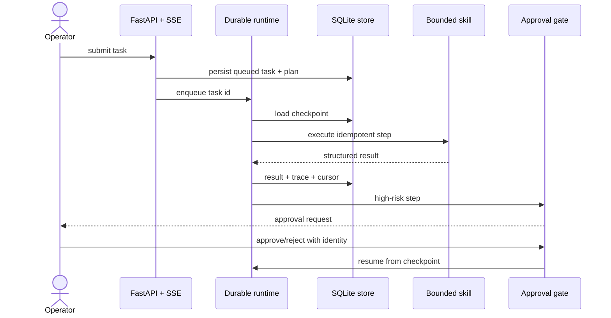

# Architecture and reliability model

## Invariants

1. A task is persisted before it is queued.
2. A completed step is content-addressed by `(task_id, step_id)` and is not executed twice.
3. High-risk steps cannot execute without a recorded approval decision.
4. A restart requeues tasks in `queued` or `running` state and resumes from the stored cursor.
5. Every state transition creates an event; model, tool, and policy operations create trace spans.
6. The offline provider makes CI deterministic; provider adapters are the only network boundary.

## Failure boundaries

| Failure | Behavior | Evidence |
|---|---|---|
| Tool exception | bounded retry, then task failure | error type and trace |
| Process restart | reload active tasks and checkpoints | persisted cursor/results |
| Duplicate delivery | skip stored step result | `step_results` primary key |
| Approval rejection | terminal failure before tool call | reviewer decision event |
| Secret-like output | redact before persistence | sanitized final summary |

