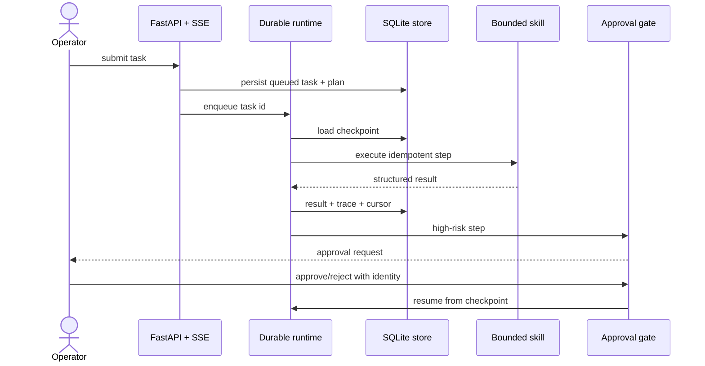

# Architecture and reliability model

## Invariants

1. A task is persisted before it is queued.
2. Results are keyed by `(task_id, step_id)` and reused when present. This is not content addressing or exactly-once execution: a crash between an external side effect and result persistence can repeat the effect. Concurrent workers are not supported.
3. High-risk steps require explicit approval; pending and missing decisions remain blocked.
4. A restart scans up to 200 recent tasks and requeues queued/running tasks. The asyncio queue itself is not durable.
5. Every state transition creates an event; model, tool, and policy operations create trace spans.
6. The offline provider makes CI deterministic. This prototype does not enforce network isolation or provide a tool sandbox.

## Failure boundaries

| Failure | Behavior | Evidence |
|---|---|---|
| Tool exception | bounded retry, then task failure | error type and trace |
| Process restart | reload active tasks and checkpoints | persisted cursor/results |
| Sequential duplicate delivery | reuse stored result; concurrent execution not protected | `step_results` primary key |
| Approval rejection | terminal failure before tool call | reviewer decision event |
| Secret-like output | redact before persistence | sanitized final summary |
